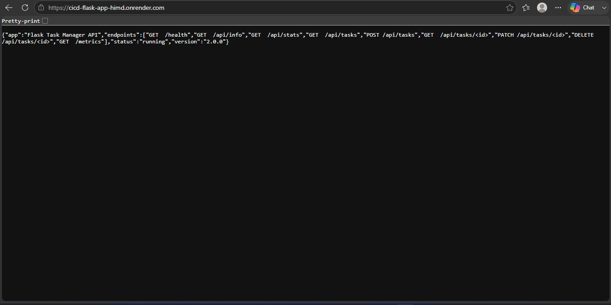
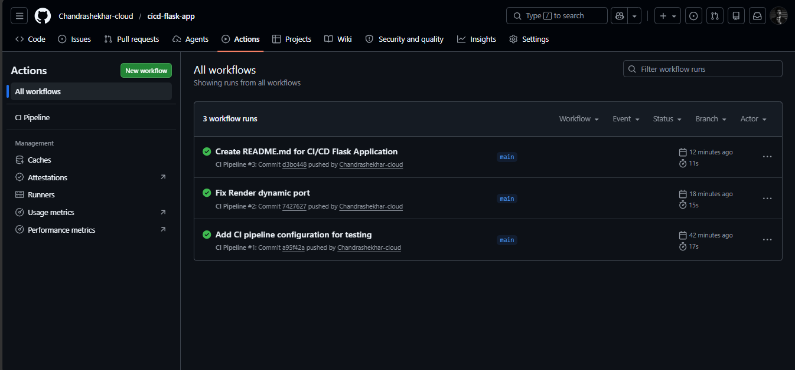

# 🚀 CI/CD Flask Application

> End-to-End DevOps Project demonstrating Flask, Docker, GitHub Actions, Automated Testing, and Cloud Deployment.

---

## 🌐 Live Demo

### Application URL

https://cicd-flask-app-himd.onrender.com

### Health Check Endpoint

https://cicd-flask-app-himd.onrender.com/health

---

## 📸 Screenshots

### Live Application



### GitHub Actions Pipeline



---

## 📌 Project Overview

This project demonstrates a complete CI/CD workflow used in modern DevOps environments.

Features:

- Flask REST API
- Health Check Endpoint
- Automated Testing using Pytest
- Docker Containerization
- GitHub Actions CI Pipeline
- Docker Hub Integration
- Cloud Deployment on Render

---

## 🏗️ Architecture

```text
Developer
    │
    ▼
GitHub Repository
    │
    ▼
GitHub Actions
    │
    ├── Install Dependencies
    ├── Run Tests
    └── Validate Build
    │
    ▼
Docker Image
    │
    ▼
Docker Hub
    │
    ▼
Render Deployment
    │
    ▼
Live Application
```

## ⚙️ Tech Stack

| Category | Technology |
|-----------|------------|
| Language | Python |
| Framework | Flask |
| Testing | Pytest |
| Containerization | Docker |
| CI/CD | GitHub Actions |
| Version Control | Git & GitHub |
| Registry | Docker Hub |
| Deployment | Render |

---

## 📂 Project Structure

```text
cicd-flask-app/
│
├── .github/
│   └── workflows/
│       └── ci.yml
│
├── tests/
│   └── test_app.py
│
├── assets/
│   ├── live-app.png
│   └── github-actions.png
│
├── Dockerfile
├── .dockerignore
├── .gitignore
├── app.py
├── requirements.txt
└── README.md
```

---

## 🔍 API Endpoints

### Root Endpoint

```http
GET /
```

Response:

```json
{
  "message": "CI/CD Pipeline Project",
  "status": "running"
}
```

### Health Endpoint

```http
GET /health
```

Response:

```json
{
  "status": "healthy"
}
```

---

## 🧪 Automated Testing

Run tests:

```bash
pytest -v
```

Expected Output:

```text
tests/test_app.py::test_home PASSED
tests/test_app.py::test_health PASSED
```

---

## 🐳 Docker Usage

Build Image:

```bash
docker build -t cicd-flask-app .
```

Run Container:

```bash
docker run -p 5000:5000 cicd-flask-app
```

Push Image:

```bash
docker push chandrashekharhs/cicd-flask-app:v1
```

---

## 🔄 Continuous Integration

Every push to the `main` branch automatically:

- Installs dependencies
- Runs automated tests
- Validates application build
- Reports build status

GitHub Actions ensures code quality before deployment.

---

## 🚀 Deployment Flow

```text
Code Change
    ↓
Git Push
    ↓
GitHub Actions
    ↓
Pytest
    ↓
Docker Build
    ↓
Docker Hub
    ↓
Render Deployment
    ↓
Production Application
```

---

## 🎯 DevOps Skills Demonstrated

- Linux Fundamentals
- Git & GitHub
- Python Development
- Flask APIs
- Docker Containerization
- GitHub Actions
- Continuous Integration
- Cloud Deployment
- Troubleshooting
- DevOps Workflow Automation

---

## 📈 Future Improvements

- Automatic DockerHub Publishing
- Prometheus Monitoring
- Grafana Dashboards
- Alertmanager Integration
- Kubernetes Deployment
- Terraform Infrastructure as Code
- GitOps Workflow

---

## 👨‍💻 Author

### Chandrashekhar H S

Aspiring DevOps / Site Reliability Engineer

GitHub:
https://github.com/Chandrashekhar-cloud

LinkedIn:
(Add Your LinkedIn URL)

---

⭐ If you found this project useful, consider giving it a star.
